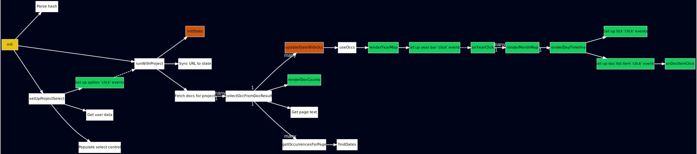

# timeline-addon

A web app that goes through the logged-in user's documents for dates, then uses them to build a timeline.

## Local dev

To run the webapp locally:

- Add 127.0.0.1 muckrock.github.io to your /etc/hosts
  - This will allow it to make requests to api.www.documentcloud.org without CORS problems.
- [Create .key and .crt files](https://letsencrypt.org/docs/certificates-for-localhost/) for localhost.
- Mash them together: `cat localhost.crt localhost.key > localhost.pem`
- sudo python3 server.py
  - This uses `localhost.pem` for SSL.
- Go to https://muckrock.github.io

## Trying it on the web without running it

Right now, it's at: https://muckrock.github.io/timeline-addon

It's in development, so you should know:

- You need to be logged in on documentcloud.org before using it.
- The left column will contain years found in the documents. Click on bars there to change the frame of the month column next to it and to scroll the dates column next to it so that dates from that year scroll into view.
- You can click a date to see a list of documents containing that date.
- You can click on an item in that list to see that document.
- The documents come in 25 at a time and get searched and graphed as they come in. Right now, it takes a while to complete, but there is a message in the corner that will tell you when it's done.

## Architecture

In order to avoid unnecessary build complexity so that this works as an example that can be used to build other web app add-ons, there is no bundler. The JavaScript files are not compiled, and instead, are referenced directly in `<script>` tags in `index.html`.

The external dependencies are [D3](https://d3js.org/) and [lodash](https://lodash.com/), which are pulled in from CDNs by the web page.

The two internal scripts are:
- `vendor/find-dates.js`, an adaptation of the [find-dates package](https://github.com/hutsoninc/find-dates/) that makes the `findDates` function available as a global on the `window` object
- `app.js`, which contains the main application code.

Everything that can be "pre-baked" (as opposed to being dynamically created in JS) into the `index.html` file is. The major containers are:

- `.control-pane`: This has controls for selecting projects and hiding and showing things as well as status messages. In `app.css`, its `position` is defined as `fixed`. So, it's always in the lower right corner no matter where the page is scrolled.
- `.doc-container`: This contains the iframe that shows the document embed if one is selected. The element is hidden by default via CSS and shown (by removing the `hidden` class) when a document is selected from a list.
-  The "timeline" containers. These house `<svg>`s upon which the various graphs are rendered.
  - `.year-map-container` has a `.timeline-layer` `<g>` that the JS uses as a root for a bar chart representing how many date references appear in each year.
  - `.month-map-container` has a `<g>` element for each month. These house ticks and text that show the date occurrences within the respective month.
    - Each of those occurrent elements can be clicked to unhide the `.doc-lists-layer` for that month, which will be populated with a list of documents that have references to that date (e.g. Jan. 6, 2021).
      - Each item in that list can be clicked to show an embed of that document.

### Execution flow

The code in `app.js` flows as in this diagram:

The parts that update the state are marked in orange and those that touch the DOM are in green.

#### New docs sequence 

The most notable sequence in the code is what you might think of as the "new docs sequence":

- When a project is selected in the select control or a new project id is entered into the input control, `runWithProject` (re)initializes the state, starts getting the documents from the project. 
- Whenever new docs come in from the API, `collectOccFromDocResult` makes occurrence objects from the results and calls (via throttling) `updateStateWithOcc`, which calls `renderYearMap`, which sets up click events.
- The sequence rests here until the user clicks a year bar.
- A year click triggers calls to `renderMonthMap` and `renderDayTimeline` which sets up click events on the day "tick" elements.
- The sequence rests here until the user click a day "tick".
- A day tick click triggers calls to show the doc list items (which represent the date occurrences that happen in that day).
- The sequence rests here until the user clicks a doc list item.
- When the user clicks a doc list item, `onDocItemClick` shows the embed iframe and tells it to load the relevant document.

### Rendering

Whenever something is to be rendered to the DOM, the [D3 exit-enter-update pattern](https://bost.ocks.org/mike/join/). The essential idea behind this is that you make the representations under a particular DOM subtree match the array of data that you have by providing you with lists of 1) what's in the DOM that no longer matches the current data, 2) what's in your data that is not yet represented in the DOM, and 3) what's in the DOM that does line up with the current data. Then, you use D3 APIs (or whatever you want), to make the DOM match you data by removing, adding, and updating DOM elements.

